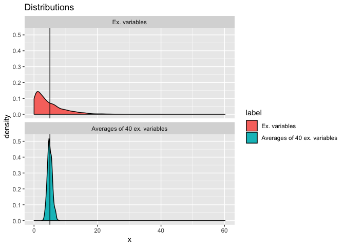
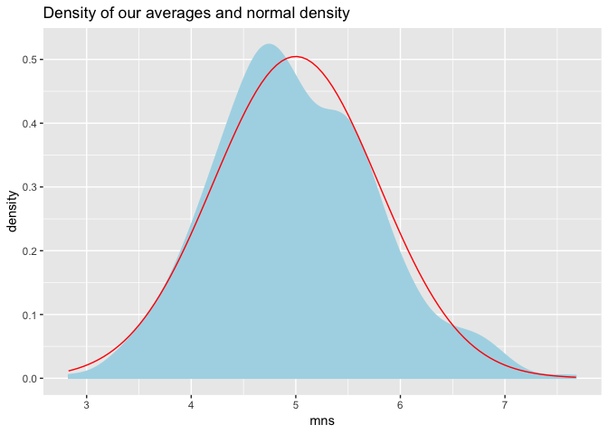

Overview
--------

In this project (Statistical Inference Course Project, Part 1) I will
investigate the distribution of averages of 40 exponential distributed
random variables in R and compare it with the Central Limit Theorem. I'm
going to simulate 1000 variables, count their mean and variance and
compare it to the theoretical mean and variance. I'm going also to
compare the distribution of random exponentials with the distribution of
averages of 40 exponentials.

Simulations
-----------

First, let's simulate 1000 exponential distributed random variables and
1000 means of 40 exponential distributed random variables. I set:

-   lambda = 0.2 for all of the simulations, according to the task.
-   arbitrary seed to get the same results every time I generate it.

<!-- -->

    n <- 1000
    lambda <- 0.2
    set.seed(25534)
    variables <- rexp(n, lambda)
    mns = NULL
    for (i in 1 : 1000) mns = c(mns, mean(rexp(40,lambda)))

Now I want to take a look on simulated averages.

    summary(mns)

    ##    Min. 1st Qu.  Median    Mean 3rd Qu.    Max. 
    ##   2.827   4.466   4.935   4.993   5.502   7.679

### Sample Mean versus Theoretical Mean

Now, let's talk about the mean of the averages (sample mean):

    mns_sample_mean <- mean(mns)
    round(mns_sample_mean,3)

    ## [1] 4.993

The theoretical mean, according to CLT, is the population mean, for the
exponential distribution it is 1/lambda. Let's count it and plot
theoretical and sample mean.

    mns_theoretical_mean <- 1/lambda
    mns_theoretical_mean

    ## [1] 5

    library(ggplot2)
    g <- ggplot(data.frame(mns = mns), aes(x = mns))
    g <- g + geom_density(col = "lightblue", fill = "lightblue")
    gMean <- g + labs(title="Density of averages and their means")
    gMean <- gMean + geom_vline(xintercept = mns_theoretical_mean, col = "red")
    gMean <- gMean + geom_vline(xintercept = mns_sample_mean, col = "black")
    gMean

So, means are pretty close, CLT works. The black line is the sample mean
and the red one is the theoretical mean.

### Sample Variance versus Theoretical Variance

I'll talk about standard deviation (standard deviation = sqrt(variance))
because it has the same units as variables. Simulated averages have
standard deviation:

    mns_sample_sd <- sd(mns)
    round(mns_sample_sd,3)

    ## [1] 0.775

The standard deviation of distribution of averages (theoretical standard
deviation) equals to standard error of the means of exponential
variables:

    mns_theoretical_sd <- 1/lambda/sqrt(40)
    round(mns_theoretical_sd,3)

    ## [1] 0.791

So, theoretical (according to CLT) and sample sd are close also.

### Distribution

Now, let's compare the distribution of averages of 40 exponential random
variables and the distribution of exponential random variables.

    data1 <- data.frame(x = variables, label = rep("Ex. variables",n))
    data2 <- data.frame(x = mns, label = rep("Averages of 40 ex. variables",n))
    data <- rbind(data1,data2)

    gg <- ggplot(data, aes(x = x))
    gg <- gg + geom_density(aes(fill=label)) + facet_wrap(.~label, nrow=2)
    gg <- gg + labs(title="Distributions")
    gg <- gg + geom_vline(xintercept = mns_theoretical_mean, col = "black")
    gg

The distribution of averages looks more Gaussian (normal) than the
distribution of exponential variables. The distribution of averages is
centered at the population mean - it is 5 (black line) and the
distribution is almost symmetrical about the center. It is also more
concentrated about the center than the distribution of exponential
variables.

Conclusions
-----------

We simulated 1000 averages of 40 exponential distributed random
variables and counted the mean and the sd (variance) of the data. Then,
we assumed that 40 variables are enough to use CLT and counted
theoretical mean and sd using CLT. Means and sds are very close to each
other which improves the power of CLT.

We also looked at the distribution of averages - and it is almost
normal, just like CLT claims. One can see also that it is more
concentrated about the center than the distribution of exponential
variables.

Appendix
--------

We know theoretical sd and mean, so we can calculate 95% confidence
intervals for the mean of averages. I will use CLT because I have 40
points and it seems to be enough.

    round(mns_theoretical_mean + c(-1,1)*qnorm(0.975)*mns_theoretical_sd,3)

    ## [1] 3.451 6.549

It contains our sample mean 4.993 as expected.

Let's also plot our density and density of the normal distributions with
the theoretical sd and mean to compare it.

    gd <- g + labs(title="Density of our averages and normal density")
    gd <- gd + stat_function(fun = dnorm, geom = "line", args = list(mean=mns_theoretical_mean,
                                                                     sd = mns_theoretical_sd),col="red")
    gd

So, distribution of averages is really close to normal.
