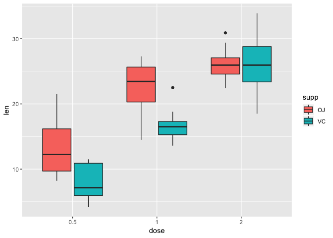
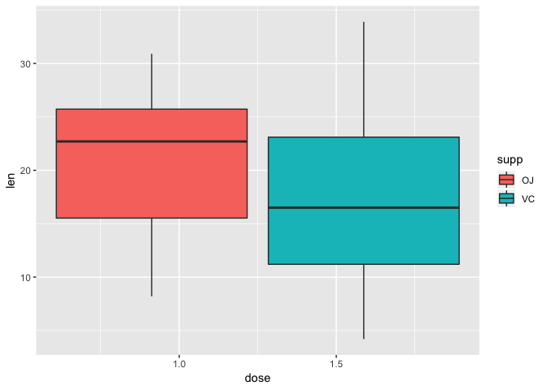

Overview
--------

For this project (Statistical Inference Course Project, Part 2) I will
use database ToothGrowth which is a part of R library datasets. There
are two delivery methods of vitamin C - orange juice (OJ) or ascorbic
acid (VC) and I would like to investigate if one of them has a stronger
effect. I can also compare effects of doses because pigs got diffrent
doses of vitamin C - 0.5, 1, and 2 mg/day.

Exploratory data analyses
-------------------------

Let's load the data and take a look on it.

    library(datasets)
    data(ToothGrowth)
    head(ToothGrowth,4)

    ##    len supp dose
    ## 1  4.2   VC  0.5
    ## 2 11.5   VC  0.5
    ## 3  7.3   VC  0.5
    ## 4  5.8   VC  0.5

    dim(ToothGrowth)

    ## [1] 60  3

So, there are 60 pigs. We can divide them into 6 groups - depending on
delivery method and dose. How many pigs are in each group?

    library(reshape2)
    tmelt <- melt(ToothGrowth,id = c("supp", "dose"),measure.vars = "len")
    dcast(tmelt,supp~dose, length)

    ##   supp 0.5  1  2
    ## 1   OJ  10 10 10
    ## 2   VC  10 10 10

There are 10 pigs in each group. And what is the total length for each
group?

    dcast(tmelt,supp~dose, sum)

    ##   supp   0.5     1     2
    ## 1   OJ 132.3 227.0 260.6
    ## 2   VC  79.8 167.7 261.4

It seems that tooth's length increases when dose increases. Length for
delivery method orange juice is bigger for small doses (0.5, 1) and
smaller for dose 2. Now let's plot lengths grouped by delivery method
and doses.

    library(ggplot2)
    ToothGrowth2 <- ToothGrowth
    ToothGrowth2$dose <- as.factor(ToothGrowth2$dose)
    ggplot(ToothGrowth2, aes(x=dose, y=len, fill=supp)) + 
        geom_boxplot()

It's shows almost the same hypothesis: length increases when dose
increases. Length for delivery method orange juice is bigger for small
doses (0.5, 1). Connection between delivery method and tooth's length is
unclear for dose 2.

Comparing of tooth growth by supp and dose
------------------------------------------

I want to test the hypothesis. I assume that data are approximately
normally distributed and I can use t test. Let's first divide the
lengths into 6 groups:

    vc05 <- ToothGrowth$len[1:10]
    vc1 <- ToothGrowth$len[11:20]
    vc2 <- ToothGrowth$len[21:30]
    oj05 <- ToothGrowth$len[31:40]
    oj1 <- ToothGrowth$len[41:50]
    oj2 <- ToothGrowth$len[51:60]

### Hypothesis 0 (1): the lengths are the same for doses 0.5 and 1

H-alternative: the length for dose 1 is greater than for dose 0.5. I
will test it for both delivery methods and look at p-values.

    t.test(vc1,vc05,paired = FALSE, var.equal = FALSE,alternative = "greater")$p.value

    ## [1] 3.405509e-07

    t.test(oj1,oj05,paired = FALSE, var.equal = FALSE,alternative = "greater")$p.value

    ## [1] 4.39246e-05

P-values are very small, we reject hypopesis 0 (1), so lengths for 1 mg
are greater than for 0.5 mg.

### Hypothesis 0 (2): the lengths are the same for doses 1 and 2

H-alternative: the length for dose 2 is greater than for dose 1. I will
test it for both delivery methods and look at p-values.

    t.test(vc2,vc1,paired = FALSE, var.equal = FALSE,alternative = "greater")$p.value

    ## [1] 4.577802e-05

    t.test(oj2,oj1,paired = FALSE, var.equal = FALSE,alternative = "greater")$p.value

    ## [1] 0.01959757

P-values are very small, we reject hypopesis 0 (2), so lengths for 2 mg
are greater than for 1 mg.

### Hypothesis 0 (3): the lengths are the same for both methods when dose is 0.5 and 1 mg

H-alternative: the length for orange juice is greater than for vitamin
C. I will test it for both doses and look at p-values.

    t.test(oj05,vc05,paired = FALSE, var.equal = FALSE,alternative = "greater")$p.value

    ## [1] 0.003179303

    t.test(oj1,vc1,paired = FALSE, var.equal = FALSE,alternative = "greater")$p.value

    ## [1] 0.0005191879

P-values are very small, we reject hypopesis 0 (3), so lengths for
orange juice are greater than for vitamin C.

### Hypothesis 0 (4): the lengths are the same for both methods when dose is 2 mg

H-alternative: the length for orange juice is less than for vitamin C.

    t.test(oj2,vc2,paired = FALSE, var.equal = FALSE,alternative = "less")$p.value

    ## [1] 0.4819258

Wow, p-value equals 0.48, it's quite a lot, we fail to reject the
hypothesis (4). Delivery method is not important when we give 2 mg.

Conclusions
-----------

If we make an assumption that sample is representative and groups have
different variations then we can conclude:

-   tooth's length increases when dose increases from 0.5 to 2
-   length for delivery method orange juice is bigger than for ascorbic
    acid for small doses (0.5, 1) and the same for dose 2 mg.

So, if we want teeth to have maximum length we should give pigs 2 mg,
delivery method is not important. If we want to give smaller dose - 0.5
or 1 mg and achieve maximum length, we should choose delivery via orange
juice.

Appendix
--------

I will also plot all doses together and divide them by delivery methods.

    library(ggplot2)
    ggplot(ToothGrowth, aes(x=dose, y=len, fill=supp)) + 
        geom_boxplot()

So, the length is bigger for orange juice than for vitamin C for all
doses together.
